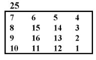

# Отчет по лабораторной работе № 14
## по курсу "Фундаментальная информатика"

Студент группы М8О-108Б-23 Григорьев Тимофей Андреевич

Работа выполнена

Преподаватель: каф. 806 Севастьянов Виктор Сергеевич

1. **Тема**: Вложенные циклы с параметрами. Обход и линеаризация матриц
2. **Цель работы**: Составить программу ввода квадратной матрицы и печати в строку всех её элементов в заданном ниже
порядке следования (обхода).
3. **Задание (вариант №25)**:



4. **Идея, метод, алгоритм решения задачи**:
    - Считать поочерёдно вводимые пользователем размер и элементы матрицы в двумерный массив.
    - С помощью вложенных циклов вывести элементы в нужном порядке.
5. **Сценарий выполнения работы**:
   1. Ввести переменную размера матрицы ```size```, считать её введённое значение.
   2. С помощью двух вложенных циклов ```for``` считать вводимые с новой строки элементы матрицы (слева направо, затем
сверху вниз) в двумерный массив целых чисел.
   3. Вывести с помощью вложенных циклов вывести введённую матрицу в отформатированном виде.
   
1. **Листинг**:
Файл с исходным кодом программы на языке Си: **[lab14.c](main.c)**.

1. **Замечания автора** по существу работы: отсутствуют.

2. **Выводы**: Составлена и отлажена программа ввода квадратной матрицы и печати в строку всех её 
элементов в заданном порядке следования (обхода). Получен опыт обработки числовых матриц и использованием многомерных
массивов и вложенных циклов.