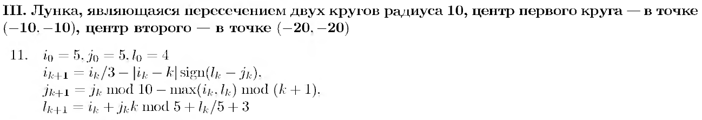

# Отчет по лабораторной работе № 9
## по курсу "Фундаментальная информатика"

Студент группы М8О-108Б-23 Григорьев Тимофей Андреевич

Работа выполнена 

Преподаватель: каф. 806 Севастьянов Виктор Сергеевич

1. **Тема**: Программирование на языке Си
2. **Цель работы**: составление и отладка простейшей программы на языке C итеративного характера с целочисленными рекуррентными соотношениями, задающими некоторое регулярное движение точки в целочисленной системе координат (i, j) с дискретным временем k и динамическим параметром движения l.
3. **Задание (вариант №11)**: 
4. **Идея, метод, алгоритм решения задачи**:
- Составить программу на языке Си, итеративно изменяющую вышеуказанные параметры и выводящую сообщение о факте попадания в заданную область не более чем за 50 шагов, результирующие значение параметра l и координаты точки.
5. **Сценарий выполнения работы**:
   1. Ввести макросы вычисления максимального и минимального числа из двух, функции сигнум и mod.
   2. Ввести метод ```move```, принимающий в качестве параметра количество итераций (шагов) (```count```), которые 
необходимо выполнить.
   3. В теле метода инициализировать переменные, хранящие значения параметров ```i```, ```j```, ```l```,  также 
переменную (```result_k```), в которую будет записан номер шага, на котором произойдёт попадание в заданную область.
   4. Ввести цикл (for) с итерацией по переменной ```k``` от 0 до значения ```count```, задающего необходимое число 
шагов.
   5. В каждой итерации вводить временные переменные, которые позволят использовать значения ```i```, ```j```, ```l``` 
из предыдущей итерации для вычисления новых значений. Вычислить новые значения ```i```, ```j```, ```l``` согласно 
формулам из задания.
   6. Затем ввести проверку значений координат ```i```, ```j``` на попадание в заданную область (используя уравнение 
окружности). В случае попадания на данной итерации, записать текущее значение ```k``` в переменную ```result_k```.
   7. После завершения цикла вывести в консоль сообщения о факте попадания в заданную область не более чем за 50 шагов, 
результирующие значение параметра ```l``` и координаты точки.
   8. В функции ```main``` вызвать метод ```move``` от 50 ходов.
6. **Протокол**: Файл с исходным кодом программы на языке Си: **[solution.c](solution.c)**.
7. **Замечания автора** по существу работы: отсутствуют
8. **Выводы**: Написана и отлажена простейшая программа на языке Си итеративного характера для вычисления параметров движения точки в целочисленной системе координат. Расширен и дополнен по сравнению с предыдущей работой опыт работы с языком Си (создание макросов, методов, итеративных циклов).
